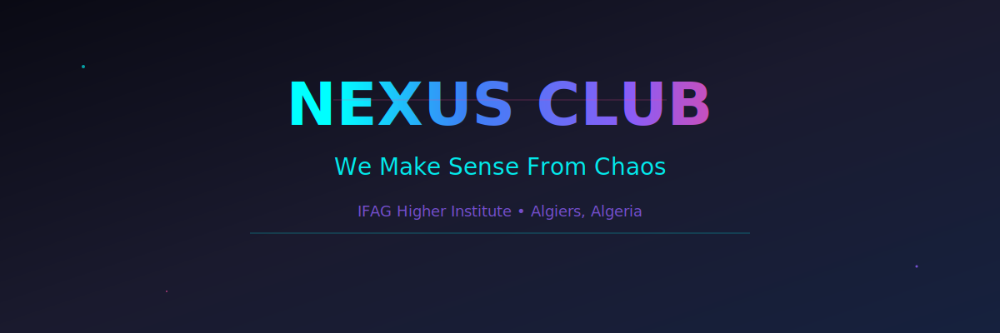

# 🚀 Nexus Club - Official Website

<div align="center">
  
  
</div>

> **"We make sense from chaos"** - A futuristic student community based in Algiers, Algeria

[](https://nextjs.org/)
[](https://www.typescriptlang.org/)
[](https://tailwindcss.com/)
[](https://www.framer.com/motion/)

## 🌟 About Nexus Club

Nexus Club is more than just a student club - we're a **community of innovators, creators, and visionaries**. Based at IFAG Higher Institute in Benaknoun, Algiers, we bring together students who are passionate about technology, innovation, and making a meaningful impact.

### 🎯 Our Mission
- **Break boundaries** between ideas and reality
- **Foster innovation** in the Algerian student community  
- **Create meaningful connections** between like-minded individuals
- **Bridge the gap** between chaos and clarity through technology

---

## 🚀 Features

### ✨ **Interactive UI/UX**
- 🎨 **Stunning Animations** - Powered by Framer Motion
- 📱 **Fully Responsive** - Mobile-first design approach
- 🎯 **Smooth Scrolling** - Enhanced user experience with scroll animations

### 🎪 **Core Sections**
- 🏠 **Home** - Immersive landing experience
- 👥 **About** - Our story, mission, and team
- 📅 **Events** - Dynamic event timeline with detailed descriptions
- 🛠️ **Projects** - Showcase of our innovative work
- 📞 **Contact** - Multiple ways to reach us

### 🔧 **Advanced Features**
- ⚡ **Performance Optimized** - Server-side rendering with Next.js
- 🔍 **SEO Friendly** - Meta tags and structured data
- 🎨 **Theme Consistency** - Custom design system
- 📊 **Analytics Ready** - Google Analytics integration
- 🔒 **Type Safe** - Full TypeScript implementation

---

## 🛠️ Tech Stack

### **Frontend Framework**
- **[Next.js 14](https://nextjs.org/)** - React framework with App Router
- **[TypeScript](https://www.typescriptlang.org/)** - Type-safe JavaScript
- **[React 18](https://react.dev/)** - Component-based architecture

### **Styling & Animation**
- **[Tailwind CSS](https://tailwindcss.com/)** - Utility-first CSS framework
- **[Framer Motion](https://www.framer.com/motion/)** - Production-ready motion library
- **[Lucide React](https://lucide.dev/)** - Beautiful icons
- **[React Icons](https://react-icons.github.io/react-icons/)** - Popular icon libraries

---

## 🚀 Quick Start

### Prerequisites
Make sure you have the following installed:
- **Node.js** (18.0 or higher)
- **npm** or **yarn** or **pnpm**
- **Git**

### 1️⃣ Clone the Repository
```bash
git clone https://github.com/your-username/nexus-club.git
cd nexus-club
```

### 2️⃣ Install Dependencies
```bash
# Using npm
npm install

# Using yarn
yarn install

# Using pnpm
pnpm install
```

### 5️⃣ Run Development Server
```bash
npm run dev
# or
yarn dev
# or
pnpm dev
```

Open [http://localhost:3000](http://localhost:3000) in your browser! 🎉

---

## 📁 Project Structure

```
nexus-club/
├── 📁 src/
│   ├── 📁 app/                    # Next.js App Router
│   │   ├── 📁 components/         # Reusable UI components
│   │   │   ├── 📁 section/        # Section components
│   │   │   ├── 📁 ui/            # User Interface components
│   │   │   ├── 📄 F00ter.tsx     # Navigation component
│   │   │   └── 📄 Navbar.tsx     # Navigation component
│   │   ├── 📁 data/              # Some data
│   │   ├── 📄 Animati0n.ts       the animati0n used
│   │   ├── 📄 global.css         # The global style 0f the site
│   │   ├── 📄 layout.tsx         # the main page
│   │   └── 📄 page.tsx           # Home page
│   ├── 📁 components/                   # Utility cmp
│   ├── 📁 lib/                 # Utility functions
├── 📁 public/                    # Static assets
│   ├── 🖼️ logo-nexus.svg        # Club logo
│   └── 📁 images/               # Image assets
├── 📄 next.config.ts             # Next.js configuration
├── 📄 tailwind.config.js         # Tailwind CSS configuration
├── 📄 package.json               # Dependencies
└── 📄 README.md                  # This file
```

---

## 🎨 Design System

### **Color Palette**
```css
/* Primary Colors */
--nexus-cyan: #00ffff      /* Electric Cyan */
--nexus-purple: #8a2be2    /* Electric Purple */
--nexus-pink: #ff1493      /* Deep Pink */
--nexus-blue: #1e40af      /* Electric Blue */

/* Background Colors */
--bg-primary: #0a0a14      /* Deep Space */
--bg-secondary: #1a1a2e    /* Dark Void */
--bg-accent: #16213e       /* Midnight Blue */

/* Text Colors */
--text-primary: #ffffff    /* Pure White */
--text-secondary: #d1d5db  /* Light Gray */
--text-muted: #6b7280      /* Medium Gray */
```

### **Typography**
- **Headings**: Inter (Bold, Extra Bold)
- **Body**: Inter (Regular, Medium)

### **Animation Principles**
- **Smooth Transitions**: 0.3s ease-in-out
- **Hover Effects**: Scale transforms & color shifts
- **Page Transitions**: Fade & slide animations
- **Scroll Animations**: Progressive reveal effects

---

## 🤝 Contributing

We welcome contributions from the community! Here's how you can help:

### **Ways to Contribute**
1. 🐛 **Report Bugs** - Found an issue? Let us know!
2. 💡 **Suggest Features** - Have an idea? Share it!
3. 🔧 **Submit PRs** - Code improvements welcome
4. 📖 **Improve Docs** - Help make our docs better
5. 🎨 **Design Feedback** - UI/UX suggestions

### **Development Workflow**
1. **Fork** the repository
2. **Create** a feature branch (`git checkout -b feature/amazing-feature`)
3. **Commit** your changes (`git commit -m 'Add amazing feature'`)
4. **Push** to the branch (`git push origin feature/amazing-feature`)
5. **Open** a Pull Request

### **Coding Standards**
- Follow **TypeScript** best practices
- Use **Prettier** for code formatting
- Write **meaningful commit messages**
- Add **comments** for complex logic
- Include **tests** for new features

---

## 📱 Social Media & Contact

### **Follow Us**
- 🎵 **TikTok**: [@nexus.club_](https://tiktok.com/@nexus.club_)
- 📸 **Instagram**: [@nexus.club_](https://instagram.com/nexus.club_)
- 💼 **LinkedIn**: [Nexus Club](https://www.linkedin.com/in/nexus-club-692baa334/)

### **Get In Touch**
- 📧 **Email**: nexusclub@insag.edu.dz
- 📍 **Location**: IFAG Higher Institute, Benaknoun, Algiers, Algeria
- 🌐 **Website**: [nexus-club](https://nexus-club-zeta.vercel.app)

---

## 🌟 Acknowledgments

- **IFAG Higher Institute** - For supporting our vision
- **Algerian Tech Community** - For inspiration and collaboration
- **Open Source Community** - For the amazing tools and libraries
- **Our Members** - For believing in our mission

---

## 🚀 Deployment

### **Vercel (Recommended)**
1. Connect your GitHub repository to Vercel
3. Deploy with one click!

### **Manual Deployment**
```bash
# Build the project
npm run build

# Start production server
npm start
```

---

## 📈 Performance

- ⚡ **Lighthouse Score**: 95+ (Performance, Accessibility, Best Practices, SEO)
- 🚀 **First Contentful Paint**: < 1.5s
- ⚡ **Time to Interactive**: < 3s
- 📱 **Mobile Responsive**: 100%

---

## 🔮 Future Plans

- [ ] 🤖 **AI-Powered Recommendations**
- [ ] 🎮 **Gamification System**
- [ ] 📱 **Mobile App Development**
- [ ] 🌍 **Multi-language Support**
- [ ] 🔐 **Advanced Authentication**
- [ ] 📊 **Analytics Dashboard**
- [ ] 🎪 **Virtual Events Platform**

---

<div align="center">

### 💫 Made with ❤️ by Nexus Club

**If you found this project helpful, please give it a ⭐!**

---

**© 2025 Nexus Club - Built with 🔥, driven by ⚡, fueled by 💡, made with ❤️.**

*"From chaos, we create clarity. From ideas, we build the future."*

</div>
